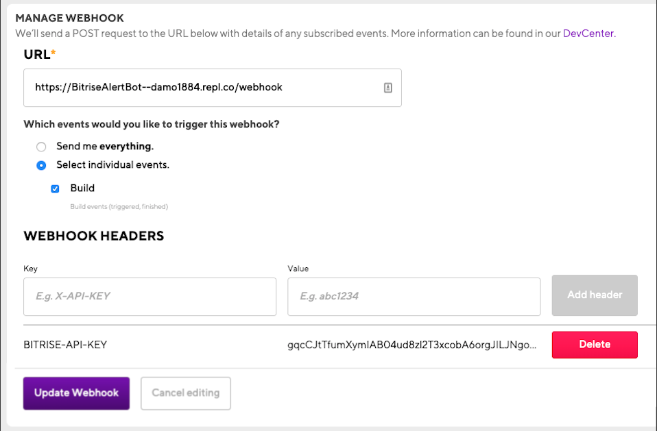

# bitrise-abort-rebuild-bot
Simple Abort Rebuild Webhook Bot

# Run Locally

## Install Dependencies

```npm i```

## Running Slack Alert Bot

```node index.js```

# Run on Repl.it

[](https://repl.it/github/DamienBitrise/bitrise-abort-rebuild-bot)

# Configuring Bitrise Build Webhook




